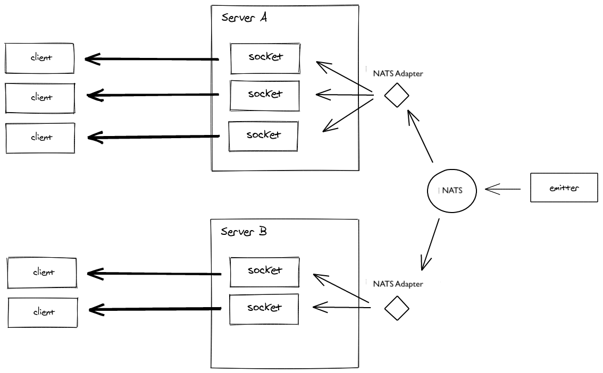

# socket.io-nats-emitter

`socket.io-nats-emitter` allows you to communicate with Socket.io servers easily without access to Socket.io



It must be used in conjunction with [socket.io-nats-adapter](https://github.com/MickL/socket.io-nats-adapter).

The current version is compatible with:

- [Socket.IO](https://github.com/socketio/socket.io) 4.x, but should also work with 2.x and 3.x
- [NATS.js](https://github.com/nats-io/nats.js/) 1.4.x, not compatible to 2.x

If you have any issues or feature requests please create a pull request.

## How to use

```bash
yarn add nats socket.io-nats-emitter
```

```ts
import { connect } from 'nats';

const client = connect('localhost');
// TODO
```

## License

MIT
